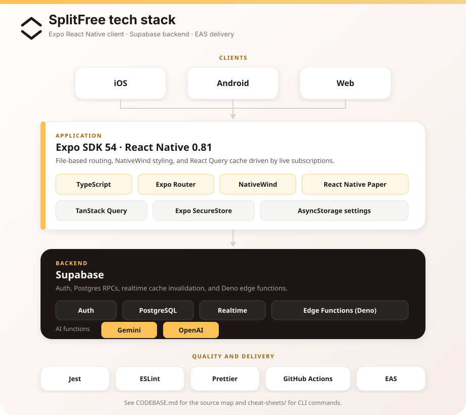

# SplitFree documentation

SplitFree is a collaborative bill-splitting app. Groups record shared expenses, balances stay in sync in real time, and settlements are calculated so people can pay each other back with as few transfers as possible.

This folder is the high-level project overview. For the source layout and coding conventions, see [`CODEBASE.md`](../CODEBASE.md). For day-to-day CLI commands, see [`cheat-sheets/`](../cheat-sheets/).

## Tech stack overview

The app is an **Expo 51 / React Native** client (iOS, Android, and web) talking to **Supabase** for auth, Postgres, and realtime updates.

### Client

| Piece | Role |
| --- | --- |
| Expo SDK 51 | Managed workflow, native modules, EAS builds |
| React Native 0.74 + React 18 | UI runtime |
| TypeScript | Typed app and generated database bindings |
| Expo Router | File-based screens under `src/app/` |
| NativeWind (Tailwind) | Cross-platform styling |
| React Native Paper | Shared UI primitives |
| TanStack Query | Server-state cache, invalidated by Supabase subscriptions |
| Expo SecureStore | Auth session persistence |
| AsyncStorage | Locale, theme, and other device settings |

### Backend

| Piece | Role |
| --- | --- |
| Supabase Auth | Sign-in, magic links |
| PostgreSQL | Groups, expenses, members, transfers, and settlement RPCs |
| Realtime | Live invalidation of React Query caches |
| Edge Functions (Deno) | `gemini` and `openai` functions under `supabase/functions/` |

### Quality and delivery

| Piece | Role |
| --- | --- |
| Jest + jest-expo | Unit tests on pull requests |
| ESLint + Prettier | Lint and format gates |
| typos | Spell-check in CI |
| GitHub Actions | PR checks targeting `master` |
| EAS | Android/iOS builds and OTA updates |

A snapshot of one development machine is in [`environment.txt`](./environment.txt).
